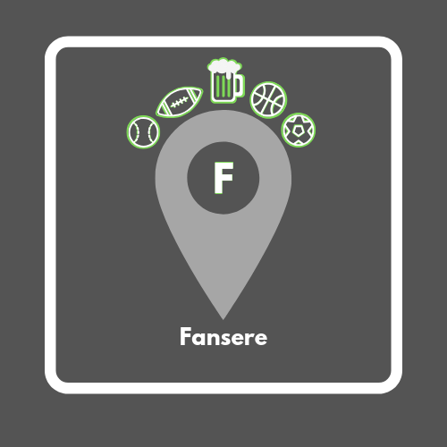

<p align="center">
<a href="https://www.fansere.com/"></a>
</p>

# Fansere - Sports Meetup App

(https://www.youtube.com/watch?v=LgvtEnydU1A&feature=youtu.be)

## Table of Contents

- [Installation](#installation)
- [About](#about)
- [Style](#style)
- [Planning](#planning)
- [Technologies](#technologies)

### Installation

Step One: Clone this repo to your local machine  
Step Two: npm install  
Step Three: npm start  
Step Four: react-native run-android OR react-native run-ios  

### About

Full Stack Sports App for Client  
Fellow fans at your fingertip. A premier mobile application to find sports fans of your favorite teams, wherever you are. Fansere gives you home field advantage with a click of a button. Fansere provides you the opportunity to match with other fans of your favorite teams, pinpoint game-watching locations, and once connected with fellow fans, reach out via in-app chat to plan where to watch the game.

### Style

[Color Scheme]
```
/* RGB */
$color1: #ffffff; // font
$color2: #000000; // main background
$color3: #7ed957; // accent color
$color4: #a6a6a6; // alt background
$color5: #f4f4f4; // accent color
$color6: #545454; // alt background
```

### Planning

(https://trello.com/b/DvXU9dNo/capstone)

1. In App Chat (Sean)  
- More DB  
- Post routes  
2. Profile Page (Marc, Owen)  
- Picture  
- Favorite teams (up to 6)  
- Tag line  
- Location  
- Edit bio form  
- Watch party only  
3. Sign Up (Ben)  
- OAuth
4. Map with sports logos and bar locations (Will)  
- Hard code bars/restaurants  
- Pin locations  
5. Sports Teams Selection Lists    
- Swipe/add functionality with all logos, colors, Icons  
- Get route/form  
6. Backend Clean up and wire to front end (Owen/Sean)  
- Update to all current info  
- Chat database  

### Technologies

ReactNative, JavaScript, PostgreSQL, Express, Node, NPM, Android Studio, Xcode, HTML, CSS, ReactNative Elements, ReactNative Navigation, ReactNative Maps API, NHL API, Knex, Fetch, OAuth

<a href="https://facebook.github.io/react-native/"></a>
<a href="https://www.javascript.com/"></a>
<a href="https://www.postgresql.org/"></a>
<a href="https://www.npmjs.com/package/express"></a>
<a href="https://nodejs.org/en/"></a>
<a href="https://npmjs.com"></a>
<a href="https://www.android.com/"></a>
<a href="https://www.apple.com/"></a>
<a href="https://html.com/"></a>
<a href="https://css-tricks.com/"></a>
